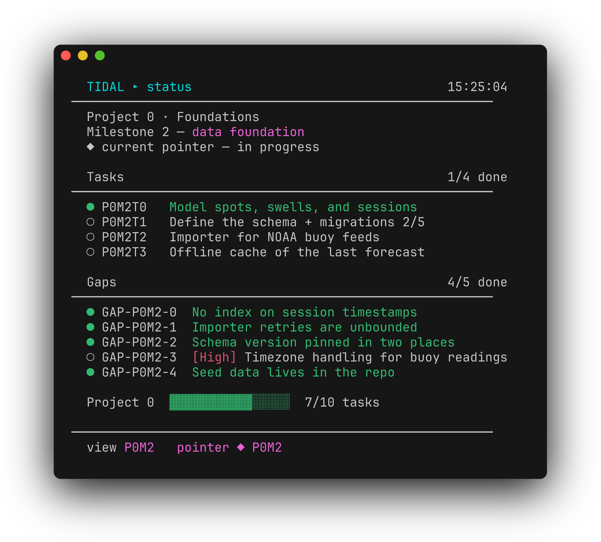

# projstatus

A live "where am I" dashboard for any repo that keeps its plan in markdown files.
One bash script, zero dependencies beyond the tools already on your machine
(bash/awk/sed/grep/git), runs on the stock macOS shell.



The idea: your plan is just folders and markdown — readable in any editor,
reviewable in pull requests, and easy for AI coding agents to read and update.
projstatus turns those files into a live dashboard: what's done, what's open,
what's next. Nothing to sync, no service, no database — the markdown *is* the
source of truth.

Here's the tour — `projstatus` to orient, `projstatus now` for the plain-text
version, then `projstatus watch` following along live as tasks get checked off
in the markdown:


Companion project: [ai-layout](https://github.com/alecmandla/ai-layout) builds
an AI coding workspace in your terminal — agent on the left, `projstatus
--watch` in the top-right pane — with one command.

## Quick start

```sh
git clone https://github.com/alecmandla/projstatus
ln -sf "$PWD/projstatus/projstatus" /usr/local/bin/projstatus   # any dir on your PATH
```

Then run `projstatus` inside any repo that has the layout. No plan yet? Scaffold
a tiny one and watch it light up:

```sh
mkdir -p docs/tasks/project-0-mvp/milestone-0-first-steps
cat > docs/tasks/project-0-mvp/milestone-0-first-steps/TASKS.md <<'EOF'
# Milestone 0 — First Steps

## P0M0T0: Sketch what the app should do

- **Status:** `[ ] TODO`

## P0M0T1: Build the smallest working version

- **Status:** `[ ] TODO`
  - [ ] happy path works
  - [ ] a friend can run it
EOF
projstatus
```

That's the whole convention: **folders are levels, `## ID: Title` headers are
tasks, statuses are checkboxes.** Mark work done by editing the markdown
(`[ ]` → `[x]`) — by hand or by your coding agent — and the dashboard follows.

Later, `projstatus update` fast-forwards the checkout the command runs from.

## Use

```sh
projstatus              # the current leaf (the pointer), once
projstatus P0M1         # peek at any node: full tokens reach a leaf …
projstatus P0           # … partial tokens show that group's overview
projstatus -2           # altitude view: the current point of development at
projstatus milestone    #   level 2 — both spellings work; words match your
                        #   repo's own labels (a milestone→phase repo answers
                        #   to `projstatus phase`); the leaf is -<levels+1>
projstatus all          # the whole tree at a glance (alias: ls)
projstatus now          # plain-text orientation (see below)
projstatus watch        # the live, interactive pane (aliases: --watch, -w)
projstatus pane         # open the live pane in a Supacode split
projstatus view <sel>   # retarget a running pane from another shell
                        #   (also: view next / view prev step the pane)
projstatus version      # print the version
projstatus update       # pull the latest (git checkout installs)
```

There are two ways to look at a repo: **pick a node** (`P0M1` — a specific place)
or **pick an altitude** (`-2` / `milestone` — the current place, seen at that
level, among its siblings). Altitude views follow the pointer as work moves.

In the live pane, click to focus it, then press:

| key | |
|----|----|
| `n` / `p` | next / previous sibling of the current view |
| `c` | jump to the live pointer |
| `a` | whole-tree overview |
| `1`–`4` | altitude: view the current point at that level |
| `g` | go to a specific one (type e.g. `P2`, `P0M1`, or `-2`, then Enter) |
| `r` | refresh now |
| `q` | quit |

When not focused, the pane just auto-refreshes (default every 4s) and follows your
work. Redraws are flicker-free (in-place, no screen clear). The pane's target is
remembered in `.git/projstatus-view` (untracked).

## `projstatus now` — orient a new session

For humans and agents starting cold: one command that says where the project stands,
as stable, grep-able plain text.

```
$ projstatus now
pointer: P1M1  docs/tasks/project-1-core-loop/milestone-1-capture
state: ready to start
next-task: P1M1T7  Wire background auto-enrich trigger after capture
file: docs/tasks/project-1-core-loop/milestone-1-capture/TASKS.md
```

If the pointer's leaf is complete, it says so (`note: …`) and hops to the first open
task anywhere in the tree.

## The convention, in full

```
<tasks-root>/<level>-<n>-<slug>/…/TASKS.md    ← 1–4 folder levels
                                 /GAPS.md     (optional)
                                 /ISSUES.md   (optional)
```

- **Tasks** — `## <ID>: Title` headers, each with `- **Status:** \`[x] DONE\`` or `\`[ ] TODO\``.
- **Sub-tasks** — `- [ ]` / `- [x]` checklist lines inside a task's section; open
  tasks show a `done/total` suffix.
- **Gaps** — `### GAP-… : Title` + `**Status:**` + `**Severity:**`.
- **Issues** — `### ISS-… : Title` + `**Status:**` + `**Priority:**`.
- **Pointer** — a line matching `Current pointer:` with the current folder's slug in
  backticks (e.g. in `AGENTS.md`). **Optional** — without it, "current" auto-resolves
  to the first leaf that still has unfinished tasks. The pointer may name any level;
  a group pointer descends to its first unfinished leaf.

The hierarchy is the same shape Linear uses — take whatever ordered subset your
project needs (2–5 levels):

| Linear | on disk | example |
|----|----|----|
| Initiative | a folder level `initiative-<n>-<slug>/` | `initiative-0-platform/` |
| Project | a folder level `project-<n>-<slug>/` | `project-1-core-loop/` |
| Milestone | a folder level `milestone-<m>-<slug>/` | `milestone-2-catalog/` |
| Issue | a `## <ID>: Title` header in `TASKS.md` | `## P1M2T3: Build the list` |
| Sub-issue | a checklist line inside the issue's section | acceptance criteria |

**Depth and naming are auto-detected** from the folder tree, and each level's
selector letter comes from its prefix — a `project-*/milestone-*` repo answers to
`P0M1`, an `initiative-*/project-*/milestone-*` repo to `I0P1M2`, and the level
words (`projstatus milestone`) come from your own folder names.

Task IDs double nicely as branch/worktree names (`claude/p1m2t3`): keep level
letters distinct and IDs will always lowercase into filesystem- and branch-safe
tokens.

## Adapting it to a repo

Everything is auto-detected, so most repos need **nothing**. For anything different,
drop a `.projstatus` file at the repo root (plain `KEY="value"` lines) — see
[`.projstatus.example`](.projstatus.example). All keys are optional:

| key | default |
|----|----|
| `PROJECT_NAME` | the repo folder name |
| `TASKS_ROOT` | first of `docs/tasks`, `tasks`, `planning/tasks` that exists |
| `HIERARCHY` | auto-detected — see below |
| `POINTER_FILE` / `POINTER_PATTERN` | `AGENTS.md` / `Current pointer:` |
| `INBOX` | auto-detected (`docs/ISSUES_INBOX.md`, …) |
| `TASK_RE` / `GAP_RE` / `ISS_RE` | derived from the hierarchy's letters / `^### GAP-` / `^### ISS-` |
| `WIDTH_CAP` / `REFRESH` | `72` / `4` |

`HIERARCHY` declares the folder levels, outermost first — each is
`<folder-prefix>[:<Label>[:<Letter>]]` (label and letter are derived from the prefix
when omitted), plus an optional `@<file>[:<Label>[:<Letter>]]` entry for the leaf
(default `@TASKS.md:Task:T`):

```sh
HIERARCHY="initiative-:Initiative:I project-:Project:P milestone-:Milestone:M"
```

The pre-HIERARCHY two-level keys (`OUTER_PREFIX`/`INNER_PREFIX`, `OUTER_LABEL`/…,
`OUTER_LETTER`/…) still work and imply a two-level hierarchy.

Environment overrides: `PROJSTATUS_COLS` (render width), `PROJSTATUS_NO_CLEAR=1`
(append frames instead of redrawing), `PROJSTATUS_FORCE_TTY=1` (treat stdin as
interactive).

## Tests

```sh
tests/smoke.sh            # all fixtures (2-, 3-, 4-level + legacy keys), bash 3.2
tests/smoke.sh depth4     # one fixture
```
